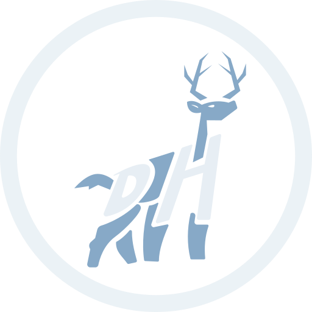

# DeerHacks

<p align="center">
    
</p>

<p align="center">
   <a href="https://app.netlify.com/sites/deerhacks/deploys">
    
  </a>
  <a href="https://deerhacks.ca">
    
  </a>
</p>

## Setup

1. Run `yarn install` to install dependencies
2. Install all the required workspace @recommended extensions
3. Add the required .env files from the mcss drive

## Getting Started

First, run the development server:

```bash
yarn dev
```

Open [http://localhost:3000](http://localhost:3000) with your browser to see the result.
