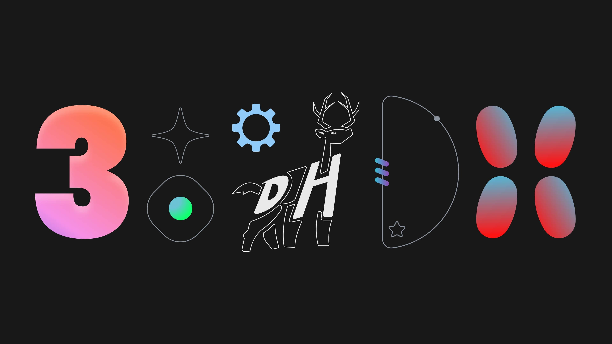

# DeerHacks

[](https://deerhacks.ca)

> DeerHacks Hackathon 2024 Dashboard

[](https://app.netlify.com/sites/deerhacks/deploys)
[](https://deerhacks.ca)

## Setup

1. Run `yarn install` to install dependencies
2. Install all the required workspace `@recommended` extensions
3. Add the required `.env` files from the discord / mcss drive

## Getting Started

First, run the development server:

```bash
yarn dev
```

Open [http://localhost:3000](http://localhost:3000) with your browser to see the result.

### Going Full Stack

The DeerHacks dashboard leverages the [DeerHacks Backend](https://github.com/utmmcss/deerhacks-backend) and [DeerHacks CMS](https://github.com/utmmcss/deerhacks-cms) to provide a full stack experience. To get started, follow the instructions in the respective repositories.

Ensure that the ports and environments are configured to work with each other.

## Testing

Run the commands to catch any linting / type errors:

```bash
yarn lint
yarn check-types
```

These commands are run before pushing with `husky` and in our CI/CD pipeline with `GitHub Actions`.
